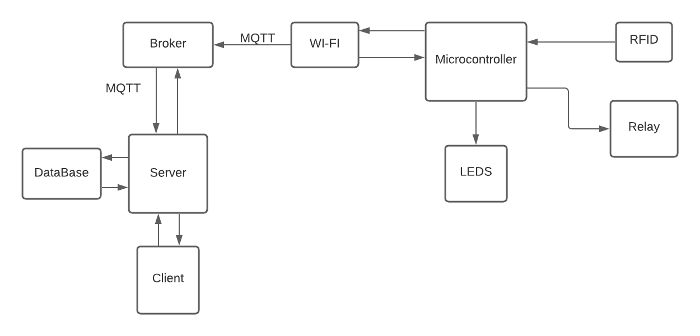

# Access Control
This project consist on a access control system. It uses microcontroller ESP8266 for internet connection, MQTT as my data transfer protocol, NodeJS as the backend programming Language, Express as the framework for the API and MySQL as the Database. 

The architecture of the complete project looks like this:  

# Directory
In this section I discribe briefly what is each folder. 

## Access_Control
In this folder is the microcontroller project, is programmed using the PIO IDE. 

## DB_Docker
This is a image to create a container with a MySQL Database and the DB queries for creating the tables. 

## HW_Design
This folder includes the KiCad project for the circuit. 

## Web-client
This folder includes the frontend of the projects, hasn't started yet this part. 

## webApp
This folder includes the NodeJS code for the backend. 
