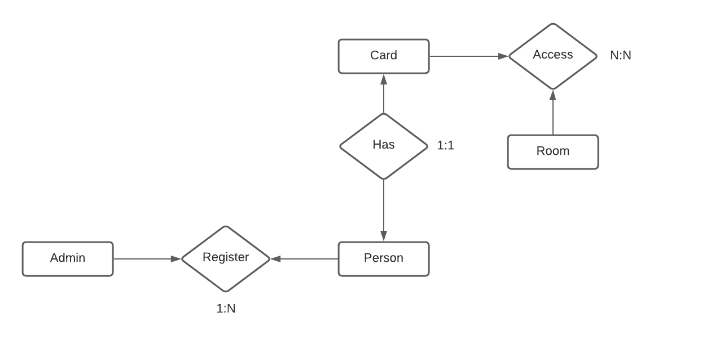

# WebApp
This server is made with NodeJS and Express in order to manage all the information that comes from different devices, database management and service routing.

to start running the project as developer: 
1. create a .env file and copy the content from .env.example to .env, example:</br>
```
PORT=3000

DB_HOST=localhost
DB_PORT=3333
DB_USER=root
DB_PASS=root123
DB=access

MQTT_HOST=192.90.0.90
MQTT_PORT=1883
MQTT_USERNAME=username
MQTT_PASS=password
```
</br>
Important note: If you dont implement access control to your MQTT broker, skip the last two variables. In order to test the server is not neccesary the MQTT variables at all</br>

2. Run the following command: 
```
npm run dev
```

For more information please read the [Documentation](https://github.com/juamarCas/Access_control/wiki/API-Documentation "API Documentation")

## Services

## Database
MySQL is the database used to store information and it follows this simplified design: </br>


## MQTT
For the MQTT broker I decided to use EMQX installed in my raspberry PI 4, but it can be other software like Mosquitto. You can read more info in their webpage: [EMQX](https://www.emqx.io/). 

### MQTT Topics

This section describes how the topics are used in this project, you can modify it as you need.

The topics are managed like the following example: </br>
1. For publishing from the microcontroller to the server: _bld1/apt3/room1_. This means: Building one/apartment 3/room 1
2. Topic where the microcontroller subscribes: _bld1/apt3/room1/acc_. acc is for access, this is called when the server sends a message to granting acces or not to a person.
3. The server is subscribed to: _bld1/apt3/+_ meaning that every message are sent to apartment 3 (three) will be managed by this server. You can add more subscriptions as you need.</br>
4. The server to grant or deny permission publish to the topic where the request is made. For example: If it receive a request from _bld2/apt4/room6_ it send the response in the form {_bld2/apt4/room6_, 'on'} ('on' or 'off' depending if can acces or not). </br>

You can modify the topics and actions of the MQTT service in _./src/MQTT/mqtt.js_ 